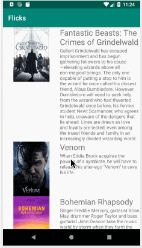

# Project 1 - *Flicks*

**Flicks** shows the latest movies currently playing in theaters. The app utilizes the Movie Database API to display images and basic information about these movies to the user.

Time spent: **2.5** hours spent in total

## User Stories

The following **required** functionality is completed:

* [x] User can view a list of movies (title, poster image, and overview) currently playing in theaters from the Movie Database API.

* [X] Views should be responsive for both landscape/portrait mode.
      * [x] In portrait mode, the poster image, title, and movie overview is shown.
      * [] In landscape mode, the rotated alternate layout should use the backdrop image instead and show the title and movie overview to the right of it.

## Video Walkthrough

Here's a walkthrough of implemented user stories:

GIF created with [LiceCap](http://www.cockos.com/licecap/).

## Notes

Describe any challenges encountered while building the app.
Identifying where exactly to decide which image to use.

## Open-source libraries used

- [Android Async HTTP](https://github.com/loopj/android-async-http) - Simple asynchronous HTTP requests with JSON parsing
- [Glide](https://github.com/bumptech/glide) - Image loading and caching library for Android

## License

    Copyright [yyyy] [name of copyright owner]

    Licensed under the Apache License, Version 2.0 (the "License");
    you may not use this file except in compliance with the License.
    You may obtain a copy of the License at

        http://www.apache.org/licenses/LICENSE-2.0

    Unless required by applicable law or agreed to in writing, software
    distributed under the License is distributed on an "AS IS" BASIS,
    WITHOUT WARRANTIES OR CONDITIONS OF ANY KIND, either express or implied.
    See the License for the specific language governing permissions and
    limitations under the License.
